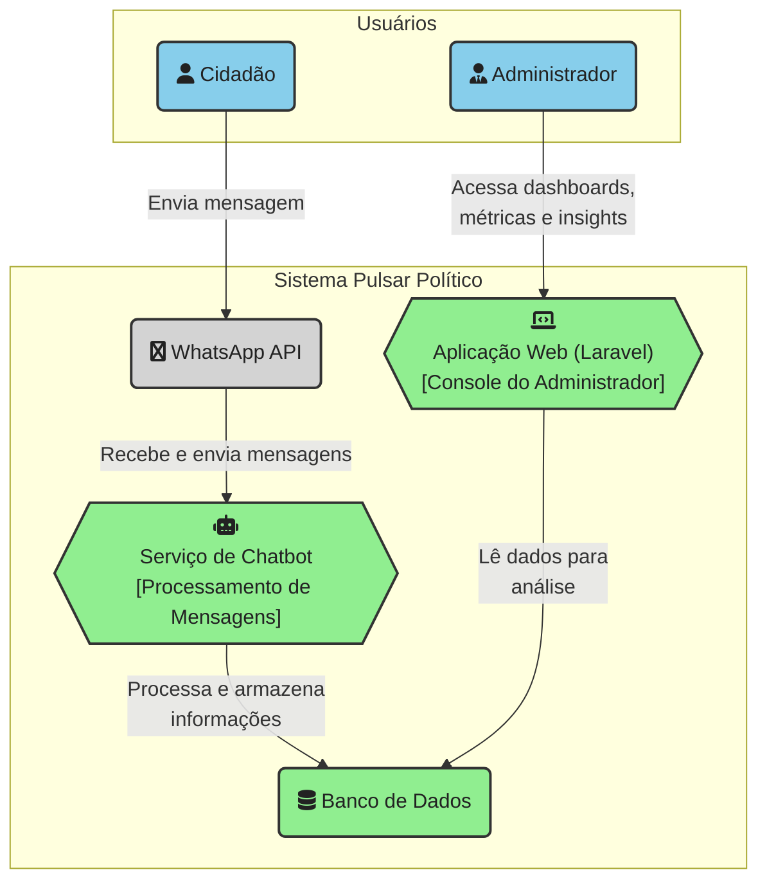

# **Pulsar Político - Plataforma de Ouvidoria Inteligente**

**Pulsar Político** é uma plataforma de ouvidoria inteligente que conecta populações (cidadãos, clientes, colaboradores) diretamente aos administradores responsáveis, utilizando o WhatsApp como canal principal de comunicação.

Através de um chatbot conversacional, o sistema coleta reclamações, feedbacks e alertas, organizando os dados e utilizando IA para gerar métricas, insights e sugestões de melhoria de forma contínua. O objetivo é transformar a escuta em inteligência acionável, ajudando gestores a compreender o que realmente "pulsa" em sua comunidade ou organização.

Este projeto está sendo desenvolvido como parte da disciplina [IF1006 - Transformação Digital com IA](https://github.com/assertlab/ai-design-engineering), da [Universidade Federal de Pernambuco (UFPE)](https://www.ufpe.br).

---

## 🎯 Objetivos do Projeto

- **Canal de Comunicação Acessível:** Utilizar o WhatsApp como um canal universal e de fácil acesso para que os cidadãos possam se comunicar.
- **Coleta e Estruturação de Dados:** Capturar as interações dos usuários e, através de IA, categorizar e estruturar as informações para análise.
- **Geração de Insights para Gestores:** Oferecer um console administrativo com dashboards, métricas e relatórios que permitam uma tomada de decisão mais rápida e baseada em dados.
- **Melhora Contínua:** Fornecer um ciclo de feedback contínuo que ajude a aprimorar a gestão e a comunicação com a população.

---

## 👥 Equipe e Papéis

| Membro             | Papel Principal      | GitHub                               |
| ------------------ | ------------------------------------ | ------------------------------------ |
| Dário Vasconcelos  | Líder da Equipe / Desenvolvedor Backend | [@dariogsv](https://github.com/dariogsv) |
| Túlio Siqueira    | Desenvolvedor Frontend / Product Owner | [@djtulioo](https://github.com/djtulioo) |
| Neto               | Desenvolvedor / Engenheiro de Dados    |    |

---

## 🛠️ Estrutura e Arquitetura

A plataforma é composta por dois componentes principais: um **aplicativo web em Laravel** que serve como console para o administrador e um **serviço de chatbot** que interage com os usuários no WhatsApp.

---

## 🚀 Começando

Para executar o projeto localmente, siga as instruções detalhadas em nosso guia de build.

➡️ **[Guia de Build e Execução](BUILD.md)**

---

## 🤝 Como Contribuir

Estamos abertos a contribuições! Se você tem interesse em melhorar a plataforma, seja corrigindo um bug ou adicionando uma nova funcionalidade, por favor, leia nosso guia de contribuição.

➡️ **[Guia de Contribuição](CONTRIBUTING.md)**

---

## 🔗 Links Úteis

| Recurso                | Link                                                              |
| ---------------------- | ----------------------------------------------------------------- |
| **Quadro de Tarefas**  | GitHub Projects |
| **Registro de Issues** | GitHub Issues |
| **Documentação Geral** | `/docs` |
| **Definições do Projeto** | `/docs/reference` |