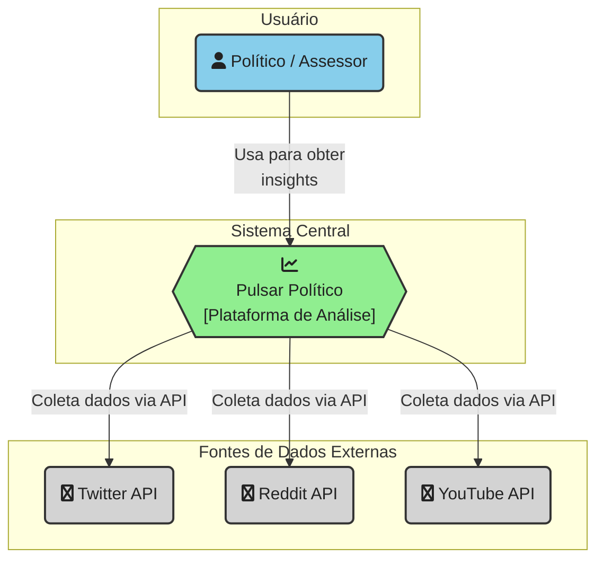

# Pulsar Político

**Pulsar Político** é uma plataforma de inteligência de dados projetada para rastrear e analisar a repercussão online de fatos e personalidades políticas. Utilizando IA, a ferramenta coleta e processa dados de redes sociais como Twitter, Reddit e YouTube para fornecer insights em tempo real sobre o sentimento do eleitorado.

Este projeto está sendo desenvolvido como parte da disciplina [IF1006 - Transformação Digital com IA](https://github.com/assertlab/ai-design-engineering), da [Universidade Federal de Pernambuco (UFPE)](https://www.ufpe.br).

---

## 🎯 Objetivos do Projeto

- **Monitoramento Contínuo:** Coletar dados de múltiplas fontes (Twitter, Reddit, YouTube) de forma automatizada.
- **Análise de Sentimento:** Aplicar modelos de Processamento de Linguagem Natural (PLN) para classificar o sentimento (positivo, negativo, neutro) das menções.
- **Visualização de Dados:** Apresentar os insights através de dashboards interativos, mostrando a evolução do sentimento e os tópicos mais discutidos.
- **Identificação de Tendências:** Detectar picos de menções e mudanças abruptas de sentimento relacionadas a eventos específicos.

---

## 👥 Equipe e Papéis

| Membro             | Papel Principal      | GitHub                               |
| ------------------ | ------------------------------------ | ------------------------------------ |
| Dário Vasconcelos  | Líder da Equipe / Desenvolvedor Backend | [@dariogsv](https://github.com/dariogsv) |
| Túlio Siqueira    | Desenvolvedor Frontend / Product Owner | [@djtulioo](https://github.com/djtulioo) |
| Neto               | Desenvolvedor / Engenheiro de Dados    | [@ejces](https://github.com/NetoCassimiro)   |

---

## 🛠️ Estrutura e Arquitetura

A arquitetura do sistema segue o modelo C4 para garantir clareza e manutenibilidade. Os diagramas detalhados podem ser encontrados no diretório [`/docs/diagrams`](./docs/diagrams/).

*(Aqui podemos adicionar o diagrama de contexto do C4 Model quando estiver pronto)*

---

## 🚀 Começando

Para executar o projeto localmente, siga as instruções detalhadas em nosso guia de build.

➡️ **[Guia de Build e Execução](BUILD.md)**

---

## 🤝 Como Contribuir

Estamos abertos a contribuições! Se você tem interesse em melhorar o Pulsar Político, seja corrigindo um bug ou adicionando uma nova funcionalidade, por favor, leia nosso guia de contribuição.

➡️ **[Guia de Contribuição](CONTRIBUTING.md)**

---

## 🔗 Links Úteis

| Recurso                | Link                                                              |
| ---------------------- | ----------------------------------------------------------------- |
| **Quadro de Tarefas**  | GitHub Projects |
| **Registro de Issues** | GitHub Issues |
| **Documentação Geral** | `/docs` |
| **Definições do Projeto** | `/docs/reference` |
